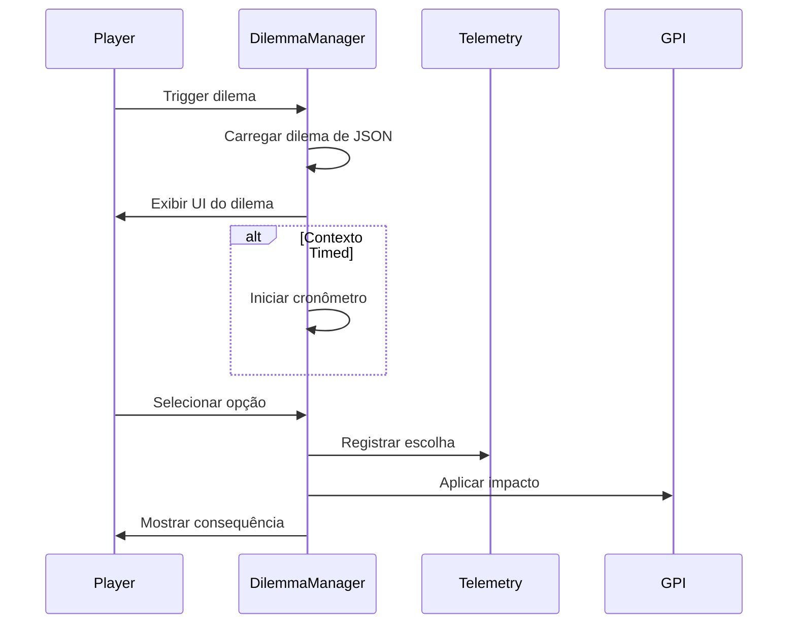

# SPEC-001: Sistema de Dilemas Force-Choice

## Metadata
- **ID**: SPEC-001
- **Status**: Draft
- **Priority**: Critical
- **Depends On**: Constitution
- **Enables**: SPEC-002 (Pipeline de Métricas)

---

## 1. Objetivo

Implementar o sistema de dilemas force-choice que apresenta cenários análogos em dois contextos (calm/timed) para medir a **dissonância comportamental** do jogador.

---

## 2. Requisitos Funcionais

### 2.1 Estrutura de Dilema

Cada dilema DEVE conter:

```typescript
interface Dilemma {
  id: string;                    // Ex: "DLM001"
  name: string;                  // Nome descritivo
  context: 'calm' | 'timed';     // Contexto de apresentação
  analogPairId?: string;         // ID do dilema análogo (calm↔timed)
  timeLimit?: number;            // Segundos (só para timed)
  
  scenario: string;              // Descrição da situação
  location: string;              // Cena onde ocorre
  npcInvolved: string[];         // NPCs envolvidos
  
  tradeOffId: string;            // Referência à matriz de trade-offs
  
  options: DilemmaOption[];      // Mínimo 2, máximo 3 opções
}

interface DilemmaOption {
  id: string;
  text: string;                  // Texto da escolha
  gpiImpact: {
    execution: number;           // -2 a +2
    collaboration: number;
    resilience: number;
    innovation: number;
  };
  discAlignment: ('D' | 'I' | 'S' | 'C')[];
  bigFiveAlignment: ('O' | 'C' | 'E' | 'A' | 'N')[];
  consequences: {
    immediate: string;
    delayed?: string;
  };
}
```

### 2.2 Regras de Trade-off

**OBRIGATÓRIO**: Toda opção deve ter pelo menos um impacto positivo e um negativo.

```javascript
// Validação de trade-off
function validateOption(option) {
  const impacts = Object.values(option.gpiImpact);
  const hasPositive = impacts.some(v => v > 0);
  const hasNegative = impacts.some(v => v < 0);
  return hasPositive && hasNegative;
}
```

### 2.3 Sistema de Pares Análogos

Para cada dilema `calm`, deve existir um `timed` análogo:

| Calm ID | Timed ID | Trade-off |
|---------|----------|-----------|
| DLM001  | DLM001_T | Execução vs Colaboração |
| DLM002  | DLM002_T | Colaboração vs Execução |
| DLM003  | DLM003_T | Execução vs Inovação |

### 2.4 Apresentação Visual

```
┌─────────────────────────────────────────┐
│  [DILEMA] O Prazo ou o Colega           │
│                                          │
│  ⏱️ 15s (se timed)                       │
│                                          │
│  O Chefe Silva precisa do relatório...   │
│                                          │
│  ┌─────────────────────────────────────┐ │
│  │ A) Foco no meu relatório...         │ │
│  └─────────────────────────────────────┘ │
│  ┌─────────────────────────────────────┐ │
│  │ B) Ajudo Ana primeiro...            │ │
│  └─────────────────────────────────────┘ │
└─────────────────────────────────────────┘
```

---

## 3. Fluxo de Execução



---

## 4. Telemetria Obrigatória

Cada escolha de dilema DEVE registrar:

```javascript
{
  event_type: 'dilemma_choice',
  timestamp: Date.now(),
  session_id: string,
  user_id: string,
  data: {
    dilemma_id: string,
    option_chosen: string,
    context: 'calm' | 'timed',
    time_limit: number | null,
    response_time_ms: number,
    gpi_impact: { execution, collaboration, resilience, innovation },
    trade_off_id: string,
    analog_pair_id: string | null,
    scene: string,
    npcs_present: string[]
  }
}
```

---

## 5. Arquivos a Criar/Modificar

| Arquivo | Ação | Descrição |
|---------|------|-----------|
| `src/managers/DilemmaManager.js` | CRIAR | Gerenciador central de dilemas |
| `src/scenes/DilemmaScene.js` | CRIAR | Cena de UI para dilemas |
| `src/data/interactions/dilemmas.json` | MODIFICAR | Adicionar pares análogos |
| `src/constants/GameEvents.js` | MODIFICAR | Adicionar DILEMMA_EVENTS |

---

## 6. Critérios de Aceitação

- [ ] Dilemas carregados de `dilemmas.json`
- [ ] Trade-off validado antes de apresentar
- [ ] Cronômetro funcional para contexto timed
- [ ] Telemetria completa registrada
- [ ] Pares análogos linkados corretamente
- [ ] UI responsiva e acessível
- [ ] Consequências exibidas após escolha

---

## 7. Justificativa Acadêmica

O sistema de dilemas force-choice elimina o viés de desejabilidade social (BIRKELAND et al., 2006) ao forçar trade-offs reais. A comparação calm/timed permite medir a dissonância comportamental conforme proposto no GDD.

**Referências**:
- BIRKELAND, S. A. et al. (2006). Meta-analytic investigation of job applicant faking.
- SIOP (2018). Principles for validation and use of personnel selection procedures.
