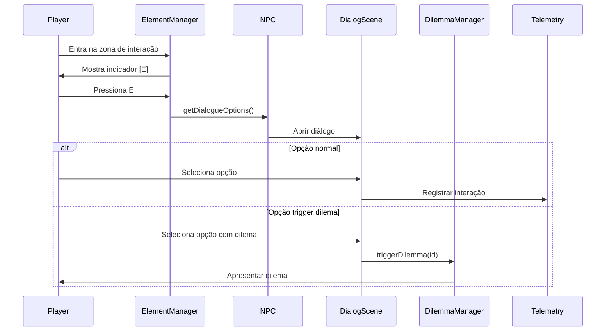

# SPEC-005: Atribuição de NPCs em Mapas via data/elements

## Metadata
- **ID**: SPEC-005
- **Status**: Draft
- **Priority**: High
- **Depends On**: Constitution
- **Enables**: SPEC-006 (Jornadas), SPEC-001 (Dilemas)

---

## 1. Objetivo

Definir o sistema de carregamento de NPCs e elementos interativos em cada mapa através dos arquivos JSON em `src/data/elements/`, seguindo o princípio Data-Driven.

---

## 2. Estrutura de Dados

### 2.1 Arquivo de Elementos por Mapa

Cada mapa tem seu arquivo em `src/data/elements/{mapId}.json`:

```json
{
  "mapId": "reception",
  "version": "1.0.0",
  "description": "Elementos interativos da cena de recepção",
  
  "npcs": [
    {
      "id": "NPC_RECEPTIONIST",
      "archetypeId": "ARC_HELPFUL",
      "name": "Helena",
      "role": "Recepcionista",
      "position": { "x": 280, "y": 230 },
      "sprite": {
        "key": "npc_receptionist",
        "scale": 2,
        "animations": {
          "idle": "receptionist_idle",
          "talk": "receptionist_talk"
        }
      },
      "behavior": {
        "movement": "static",
        "facing": "down",
        "interactRadius": 64
      },
      "dialogue": {
        "greeting": "Olá! Bem-vindo à Janus Corp.",
        "options": ["opt_info", "opt_directions", "opt_meeting", "opt_bye"]
      },
      "dilemmas": ["DLM001", "DLM007"],
      "journeyStages": ["J001_S1", "J002_S1"],
      "gpiRelevance": {
        "primaryAxis": "collaboration",
        "secondaryAxis": "execution"
      }
    }
  ],
  
  "objects": [
    {
      "id": "OBJ_EMERGENCY_PANEL",
      "type": "interactive",
      "name": "Painel de Emergência",
      "position": { "x": 100, "y": 150 },
      "sprite": { "key": "panel_emergency", "frame": 0 },
      "interaction": {
        "type": "action",
        "actionId": "ENV004",
        "requiredItem": null,
        "gpiImpact": { "execution": 1, "resilience": 1 }
      },
      "conditions": {
        "visible": { "quest": "J001_S1", "status": "completed" },
        "interactable": { "quest": "J001_S2", "status": "active" }
      }
    }
  ],
  
  "doors": [
    {
      "id": "DOOR_HALLWAY",
      "name": "Corredor Principal",
      "position": { "x": 480, "y": 100, "width": 48, "height": 32 },
      "targetScene": "HallwayScene",
      "targetSpawn": { "x": 50, "y": 300 },
      "locked": false,
      "conditions": {
        "unlockRequires": null
      }
    }
  ],
  
  "zones": [
    {
      "id": "ZONE_TRIGGER_DILEMMA",
      "type": "trigger",
      "bounds": { "x": 200, "y": 200, "width": 100, "height": 100 },
      "onEnter": {
        "action": "triggerDilemma",
        "dilemmaId": "DLM002",
        "once": true
      }
    }
  ]
}
```

### 2.2 Arquétipos de NPC

Arquivo: `src/data/npcs/npc-archetypes.json`

```json
{
  "archetypes": [
    {
      "id": "ARC_HELPFUL",
      "name": "Prestativo",
      "description": "NPC que oferece ajuda e informações",
      "defaultBehavior": {
        "friendliness": "high",
        "proactivity": "medium",
        "patience": "high"
      },
      "dialogueStyle": "formal_friendly",
      "gpiInfluence": {
        "tendToward": "collaboration",
        "dilemmaTypes": ["help_vs_task", "share_vs_keep"]
      }
    },
    {
      "id": "ARC_DEMANDING",
      "name": "Exigente",
      "description": "NPC que pressiona por resultados",
      "defaultBehavior": {
        "friendliness": "low",
        "proactivity": "high",
        "patience": "low"
      },
      "dialogueStyle": "formal_direct",
      "gpiInfluence": {
        "tendToward": "execution",
        "dilemmaTypes": ["deadline_vs_quality", "follow_vs_question"]
      }
    },
    {
      "id": "ARC_ANXIOUS",
      "name": "Ansioso",
      "description": "NPC em situação de estresse",
      "defaultBehavior": {
        "friendliness": "medium",
        "proactivity": "low",
        "patience": "low"
      },
      "dialogueStyle": "informal_nervous",
      "gpiInfluence": {
        "tendToward": "resilience",
        "dilemmaTypes": ["calm_vs_rush", "support_vs_ignore"]
      }
    },
    {
      "id": "ARC_CREATIVE",
      "name": "Criativo",
      "description": "NPC que propõe alternativas não-convencionais",
      "defaultBehavior": {
        "friendliness": "high",
        "proactivity": "high",
        "patience": "medium"
      },
      "dialogueStyle": "informal_enthusiastic",
      "gpiInfluence": {
        "tendToward": "innovation",
        "dilemmaTypes": ["conventional_vs_novel", "safe_vs_risky"]
      }
    }
  ]
}
```

---

## 3. Sistema de Carregamento

### 3.1 ElementManager.js

```javascript
export class ElementManager {
  constructor(scene) {
    this.scene = scene;
    this.npcs = new Map();
    this.objects = new Map();
    this.doors = new Map();
    this.zones = new Map();
  }
  
  async loadMapElements(mapId) {
    const data = await this.fetchElementData(mapId);
    
    // Carregar NPCs
    for (const npcData of data.npcs || []) {
      const npc = await this.createNPC(npcData);
      this.npcs.set(npcData.id, npc);
    }
    
    // Carregar objetos interativos
    for (const objData of data.objects || []) {
      if (this.checkConditions(objData.conditions?.visible)) {
        const obj = this.createInteractiveObject(objData);
        this.objects.set(objData.id, obj);
      }
    }
    
    // Carregar portas
    for (const doorData of data.doors || []) {
      const door = this.createDoor(doorData);
      this.doors.set(doorData.id, door);
    }
    
    // Configurar zonas de trigger
    for (const zoneData of data.zones || []) {
      this.createTriggerZone(zoneData);
    }
  }
  
  async createNPC(npcData) {
    // Carregar arquétipo
    const archetype = await this.getArchetype(npcData.archetypeId);
    
    // Criar sprite
    const npc = this.scene.add.sprite(
      npcData.position.x,
      npcData.position.y,
      npcData.sprite.key
    );
    
    // Aplicar configurações
    npc.setScale(npcData.sprite.scale || 1);
    npc.setData('npcData', npcData);
    npc.setData('archetype', archetype);
    
    // Configurar física
    this.scene.physics.add.existing(npc, true);
    
    // Configurar interação
    this.setupNPCInteraction(npc, npcData);
    
    return npc;
  }
  
  setupNPCInteraction(npc, npcData) {
    const interactZone = this.scene.add.zone(
      npcData.position.x,
      npcData.position.y,
      npcData.behavior.interactRadius * 2,
      npcData.behavior.interactRadius * 2
    );
    
    this.scene.physics.add.existing(interactZone);
    
    this.scene.physics.add.overlap(
      this.scene.player,
      interactZone,
      () => this.onPlayerNearNPC(npc, npcData)
    );
  }
}
```

---

## 4. Fluxo de Interação com NPC



---

## 5. Integração com Jornadas

### 5.1 Verificação de Progresso

```javascript
// Verificar se NPC está disponível para estágio de jornada
function isNPCAvailableForJourney(npcId, journeyStageId) {
  const npcData = elementManager.getNPCData(npcId);
  const journeyProgress = journeyManager.getProgress();
  
  // NPC está associado a este estágio?
  if (!npcData.journeyStages.includes(journeyStageId)) {
    return false;
  }
  
  // Estágio está ativo?
  const stage = journeyManager.getStage(journeyStageId);
  return stage.status === 'active';
}
```

### 5.2 Atualização Visual

```javascript
// Mostrar indicador de quest no NPC
function updateNPCQuestIndicator(npcId) {
  const npc = elementManager.getNPC(npcId);
  const npcData = npc.getData('npcData');
  
  for (const stageId of npcData.journeyStages) {
    if (journeyManager.isStageActive(stageId)) {
      showQuestMarker(npc, 'active');  // ! amarelo
      return;
    }
    if (journeyManager.isStageCompleted(stageId)) {
      showQuestMarker(npc, 'completed');  // ✓ verde
      return;
    }
  }
  
  hideQuestMarker(npc);
}
```

---

## 6. Arquivos por Mapa

| Mapa | Arquivo | NPCs | Objetos |
|------|---------|------|---------|
| Reception | `reception.json` | Helena (recepcionista), João (segurança) | Painel emergência, Bebedouro |
| Office | `office.json` | Silva (chefe), Ana (colega), Pedro (estagiário) | Computadores, Documentos |
| IT Room | `it-room.json` | Carlos (TI) | Servidores, Terminal |
| Meeting Room | `meeting-room.json` | Mariana (RH) | Projetor, Quadro |
| Hallway | `hallway.json` | - | Extintores, Saídas |
| Lab | `lab.json` | Dr. Santos | Equipamentos, Amostras |

---

## 7. Arquivos a Criar/Modificar

| Arquivo | Ação | Descrição |
|---------|------|-----------|
| `src/elements/ElementManager.js` | MODIFICAR | Implementar carregamento completo |
| `src/data/elements/office.json` | CRIAR | Elementos do escritório |
| `src/data/elements/it-room.json` | CRIAR | Elementos da sala de TI |
| `src/data/elements/meeting-room.json` | CRIAR | Elementos da sala de reunião |
| `src/data/elements/hallway.json` | CRIAR | Elementos do corredor |
| `src/data/elements/lab.json` | CRIAR | Elementos do laboratório |
| `src/data/npcs/npc-archetypes.json` | MODIFICAR | Completar arquétipos |

---

## 8. Critérios de Aceitação

- [ ] Cada mapa carrega NPCs do JSON correspondente
- [ ] Arquétipos aplicados corretamente
- [ ] Indicador [E] aparece quando próximo
- [ ] Interação abre diálogo correto
- [ ] Condições de visibilidade respeitadas
- [ ] Portas funcionam com transição de cena
- [ ] Zonas de trigger disparam eventos
- [ ] Integração com jornadas funcional

---

## 9. Justificativa Acadêmica

O sistema Data-Driven permite que o mapeamento NPC→dilema→GPI seja auditável e modificável sem alterar código. Isso facilita a documentação metodológica exigida no TCC e permite ajustes durante a fase de testes.
