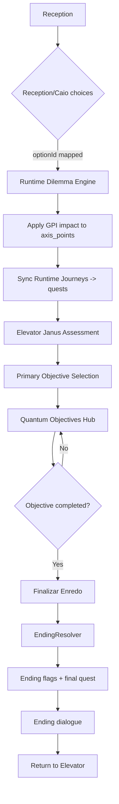

# Axis, Questions, Profiles and Narrative Gap Analysis

## 1) Executive Summary

This repository currently has two layers:

- Runtime layer (active): computes profile mainly from `axis_points_*` and a few session/minigame signals.
- Blueprint layer (not wired): large datasets for journeys, dilemmas, archetypes, balance formulas, DISC/Big Five derivation.

Main conclusion:

- The current game runtime can already produce a base axis profile (execution, collaboration, resilience, innovation).
- DISC and Big Five are not derived in runtime today.
- Most advanced data files (journeys/dilemmas/balance formulas) are present but not integrated into active game flow.

## 2) What Is Active Today (Runtime)

### 2.1 Axis score sources actually used

Active writes to `axis_points_*` come from:

1. Reception magazine stand (`read-magazine-topic`): +1 per read on selected axis.
2. Elevator Janus assessment:
   - 5 questions (2 direct + 3 likert-generated)
   - each answer gives points to one axis.
3. Elevator objective selection:
   - 1 objective choice, +2 points to one axis.
4. IT room journey:
   - manager intro bonus (+1 execution once)
   - manager round answers
   - 2 rounds with 4 collaborators using likert options.

### 2.2 Axis selection traces (without points)

Some interactions register axis intent in timeline/blockchain but do not add points:

- Receptionist options (priority axis and choice trace)
- Caio conversation options
- Generic option selection telemetry

This means there is a gap between:

- "axis choice history" and
- "axis points used for profile normalization"

## 3) Current Profile Calculation (Real)

The active base report engine uses:

- `axis_points_execution`
- `axis_points_collaboration`
- `axis_points_resilience`
- `axis_points_innovation`

Then computes normalized profile:

- `axis_percent = axis_points / sum(axis_points) * 100`

Fallback:

- if total points are zero and receptionist priority axis exists, inject minimum signal for that axis.

Coverage in report is section-based average (profile, fixed results, minigames, badges), not a psychometric confidence score.

## 4) What Is Present But Not Integrated

Data files that contain advanced design but are not used in active profile runtime:

- `src/data/config/balance-config.json`
- `src/data/interactions/dilemmas.json`
- `src/data/journeys/journeys.json`
- `src/data/npcs/npc-archetypes.json`
- `src/data/metrics/performance-config.json`

These files contain:

- DISC derivation formulas
- Big Five derivation formulas
- trade-off matrix
- calm/crisis dilemma pairs
- journey weighting and objective weighting
- quality targets and missing counts

Current runtime does not import these for scoring pipeline.

## 5) Quantitative As-Is Map

### 5.1 Scored interaction opportunities per complete run (current wired flow)

Approximate max scored events in a full run of currently wired content:

1. Elevator Janus questions: 5
2. Elevator primary objective: 1
3. IT room full two-round journey: 11
4. Reception magazine topics: 6

Total scored events: about 23

Observation:

- This is enough for an initial profile tendency.
- It is still weak for high-confidence derived DISC/Big Five, especially without forced trade-off balancing and crisis analog pairs in runtime.

### 5.2 Action map currently possible

Current high-level route:

1. Reception
2. Elevator (Janus assessment)
3. Objective selection
4. Objective hub (Quantum Objectives)
5. Selected map/minigame branches

Important runtime limitation:

- Completing an objective option in Quantum Objectives marks objective flags, but there is no global narrative finalization orchestrator yet (no real end-state scene/ending resolver).

## 6) Missing Pieces for "Concrete Profile"

To reach a relatively concrete and defensible profile in gameplay terms:

### Minimum viable target (MVP)

- 32 to 36 scored behavioral events
- at least 8 effective signals per axis
- at least 4 calm/crisis analog pairs active in runtime

Estimated missing from current ~23:

- +9 to +13 scored events

### Recommended target (better robustness)

- 44 to 52 scored behavioral events
- at least 10 to 12 effective signals per axis
- 8 to 12 calm/crisis analog pairs
- include negative and positive trade-off impact in runtime scoring

Estimated missing from current ~23:

- +21 to +29 scored events

## 7) Practical Expansion Plan

### Phase A - Activate existing design assets

1. Integrate `dilemmas.json` into interactive scenes.
2. Persist selected dilemma option IDs and apply `gpiImpact` to axis points.
3. Add analog-pair tracker (calm vs crisis dissonance).

### Phase B - Profile derivation

1. Add runtime module that reads formula config (or hardcoded stable version).
2. Compute derived DISC from axis profile.
3. Compute derived Big Five from axis profile + behavior metrics.
4. Add confidence index based on signal volume + axis balance + analog consistency.

### Phase C - Narrative completion

Create `EndingResolver` with explicit ending rules, for example:

1. Ending type by dominant axis (4 macro endings).
2. Variant by objective completed flag.
3. Modifier by dissonance level (low/medium/high).
4. Modifier by ethics/sub-behavior flags.

## 8) Suggested Ending Structure

Three practical ways to finish the story:

1. Axis-dominant ending (4 finals)
   - execution/collaboration/resilience/innovation each maps to a final resolution style.

2. Objective-conclusion ending (4 finals)
   - boss/team/solve/stabilize completion drives final narrative branch.

3. Hybrid ending matrix (recommended)
   - final = objective branch + dominant axis + dissonance modifier.
   - gives controlled scope with replay value.

## 9) Risks If Not Addressed

1. Report may look complete but remain behaviorally shallow.
2. DISC/Big Five labels can become cosmetic without actual derivation pipeline.
3. Narrative may feel unfinished due lack of explicit closure state.
4. Blueprint files may drift away from runtime and become stale.

## 10) Immediate Next Implementation Steps

1. Build `GpiRuntimeEngine` and wire dilemma scoring.
2. Implement `DerivedProfileEngine` (DISC + Big Five + confidence).
3. Implement `EndingResolver` scene/flow.
4. Add debug panel with:
   - total scored events
   - per-axis effective signals
   - analog pair coverage
   - profile confidence.

## 11) Implemented Runtime Wiring (Now Active)

The following structures are now implemented in runtime:

1. Dilemmas/Journeys runtime engine:
   - `src/runtime/DilemmaJourneyRuntime.js`
   - maps existing real options (receptionist, Caio, objective choice) into runtime dilemmas
   - applies `gpiImpact` into axis points
   - syncs runtime journeys into quests:
     - `JR_RT_001_ONBOARDING`
     - `JR_RT_002_JANUS_CALIBRATION`
     - `JR_RT_003_TI_ALIGNMENT`
     - `JR_RT_004_OBJECTIVE_RESOLUTION`

2. Real DISC and Big Five derivation:
   - `src/profile/DerivedProfileEngine.js`
   - derives DISC from axis-normalized profile using `balance-config` formulas
   - derives Big Five with real weighted formulas and N inversion handling
   - computes confidence index using signal volume, axis balance, dilemma coverage, journey coverage and objective coverage

3. Ending resolver and consistent finals:
   - `src/narrative/EndingResolver.js`
   - objective-completion + dominant-axis + confidence-tone ending id
   - writes ending flags and final quest (`JR_RT_999_ENDING_RESOLVED`)
   - integrated in `QuantumObjectivesScene` with explicit menu option:
     - `Finalizar Enredo (Resolver Desfecho)`

4. Runtime hooks:
   - Boot wiring in `src/main.js`
   - Auto capture on axis-choice append in `GameStateManager.appendAxisChoiceEntry`
   - Report integration in `src/report/baseReportEngine.js`

## 12) Final Flow (Implemented)

### 12.1 NPC/Object linkage used for runtime dilemmas

1. Receptionist options
   - source: `npc_receptionist`
   - creates runtime dilemma `DLM_RT_RECEPTION_ENTRY`

2. Caio options
   - source: `npc_sit_guy`
   - creates runtime dilemma `DLM_RT_PEER_PREP`

3. Objective options (Janus)
   - source: objective selection in Elevator/Hub
   - creates runtime dilemma `DLM_RT_PRIMARY_OBJECTIVE`

These links were chosen to activate dilemmas immediately using currently existing NPCs/objects without requiring new map entities.
