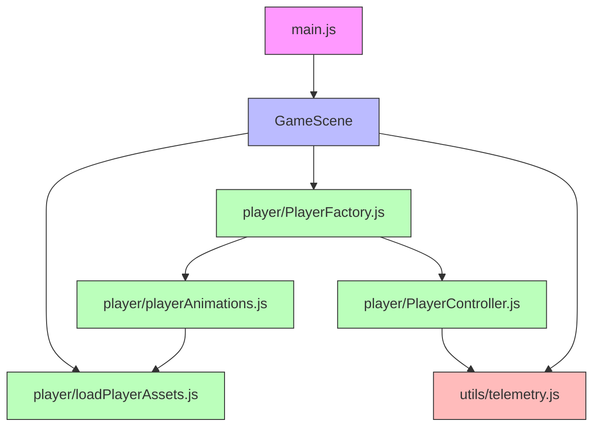

# Estrutura de Código do Janus-Protocol

Este documento explica a organização dos diretórios e arquivos do projeto, seguindo princípios de separação de responsabilidades.

## 📁 Estrutura de Diretórios

```
src/
├── assets/              # 📦 APENAS arquivos estáticos (imagens, JSON, áudio)
│   ├── leo.png
│   ├── personagem.png
│   ├── reception.json
│   ├── Modern_Office_Shadowless_16x16.png
│   └── Room_Builder_Office_16x16.png
│
├── player/              # 🎮 Tudo relacionado ao personagem jogável
│   ├── loadPlayerAssets.js     # Carrega spritesheet do player
│   ├── playerAnimations.js     # Cria animações (walk, idle, etc.)
│   ├── PlayerFactory.js        # Instancia player no mundo
│   └── PlayerController.js     # Lógica de input e movimento
│
├── scenes/              # 🎬 Cenas do jogo (estados/telas)
│   ├── GameScene.js
│   └── UIScene.js
│
├── utils/               # 🔧 Utilitários compartilhados (usados por múltiplos módulos)
│   └── telemetry.js
│
├── characters/          # 👾 Outros personagens/entidades (NPCs, inimigos)
│   ├── SlimeFactory.js      # (stub - removido do jogo)
│   └── SlimeController.js   # (stub - removido do jogo)
│
└── main.js              # 🚀 Entry point (configura Phaser e inicia jogo)
```

---

## 🧭 Princípios de Organização

### 1. **assets/ = Arquivos Estáticos Apenas**

❌ **Não coloque aqui:**
- Funções JavaScript
- Lógica de carregamento
- Classes ou controladores

✅ **Coloque aqui:**
- Imagens (PNG, JPG, SVG)
- Spritesheets
- Tilemaps JSON (exportados do Tiled)
- Áudio (MP3, WAV)
- Fontes (TTF, WOFF)
- Dados estáticos (JSON de configuração, diálogos)

**Exemplo:**
```
assets/
├── leo.png                    ✅ Spritesheet do personagem
├── reception.json             ✅ Tilemap do Tiled (recepção)
├── sound_effects/
│   └── jump.mp3               ✅ Efeito sonoro
└── loadPlayerAssets.js        ❌ ERRADO! Isso é código, vai para player/
```

---

### 2. **player/ = Módulo Coeso do Personagem**

Tudo relacionado ao **personagem jogável** fica junto:

- **loadPlayerAssets.js**: Define constantes (FRAME_WIDTH, FRAME_HEIGHT) e função para carregar spritesheet
- **playerAnimations.js**: Cria animações (walk, idle, attack) a partir do spritesheet
- **PlayerFactory.js**: Instancia o sprite do player no mundo, configura física/hitbox
- **PlayerController.js**: Lê input do teclado/gamepad e aplica movimento/animações

**Por que juntos?**
- Alta coesão: todos dependem uns dos outros
- Facilita refatoração (ex.: trocar spritesheet afeta todos esses arquivos)
- Encapsulamento: `player/` é a "caixa preta" do personagem

---

### 3. **utils/ = Utilitários Compartilhados**

Funções/classes usadas por **múltiplos módulos** sem pertencer a nenhum específico:

✅ **Exemplos válidos:**
- `telemetry.js` → usado por player, enemies, scenes
- `mathHelpers.js` → funções de distância, colisão, interpolação
- `eventBus.js` → comunicação entre módulos desacoplados
- `localStorage.js` → salvar/carregar dados do navegador

❌ **Não coloque aqui:**
- Lógica específica de um único módulo (ex.: `playerHealthManager.js` → vai para `player/`)

---

### 4. **scenes/ = Estados do Jogo**

Cada **Scene** do Phaser representa um "estado" ou "tela":

- `GameScene.js` → gameplay principal
- `UIScene.js` → overlay de UI (HUD, inventário)
- `MenuScene.js` → menu inicial
- `PauseScene.js` → tela de pausa
- `GameOverScene.js` → fim de jogo

**Responsabilidades de uma Scene:**
- Orquestrar outros módulos (criar player, carregar mapa, spawnar inimigos)
- Gerenciar transições (menu → jogo → game over)
- Configurar câmera, física, inputs globais

**Não coloque lógica complexa aqui!** Delegue para módulos específicos.

---

### 5. **characters/ = Outras Entidades**

NPCs, inimigos, boss fights, etc.:

```
characters/
├── Enemy.js
├── NPC.js
├── BossController.js
└── SlimeFactory.js   # (removido, mas mantido como stub)
```

**Diferença de player/?**
- `player/` → personagem controlado pelo jogador (único)
- `characters/` → entidades não-jogáveis (múltiplas instâncias)

---

## 🔄 Fluxo de Dependências



**Leitura:**
1. `main.js` configura Phaser e inicia `GameScene`
2. `GameScene` carrega assets via `loadPlayerAssets`
3. `GameScene` cria player via `PlayerFactory`
4. `PlayerFactory` usa `playerAnimations` (que usa constantes de `loadPlayerAssets`)
5. `PlayerFactory` retorna sprite + `PlayerController` anexado
6. `PlayerController` e scenes podem usar `telemetry` para logging

---

## 📦 Exemplo Prático: Adicionando um Inimigo

**Passo 1:** Adicionar spritesheet em `assets/`
```
assets/
└── enemy_spider.png  ✅
```

**Passo 2:** Criar módulo em `characters/`
```javascript
// characters/SpiderEnemy.js
import { logAction } from '../utils/telemetry.js';

export function createSpider(scene, x, y) {
  const sprite = scene.physics.add.sprite(x, y, 'spider');
  sprite.play('spider_walk');
  logAction('spider_spawn', { x, y });
  return sprite;
}
```

**Passo 3:** Carregar e usar na `GameScene`
```javascript
// scenes/GameScene.js
import { createSpider } from '../characters/SpiderEnemy.js';

preload() {
  this.load.spritesheet('spider', './src/assets/enemy_spider.png', {
    frameWidth: 32, frameHeight: 32
  });
}

create() {
  this.spider = createSpider(this, 200, 300);
}
```

---

## 🚫 Anti-Patterns Comuns

### ❌ Código em assets/
```
assets/
└── enemyManager.js  # ERRADO! Isso é lógica, não asset
```
**Solução:** Mova para `characters/` ou `utils/`

### ❌ Assets fora de assets/
```
player/
└── player_spritesheet.png  # ERRADO! Imagens vão em assets/
```
**Solução:** Mova para `assets/` e referencia o caminho relativo

### ❌ God Scene (Scene faz tudo)
```javascript
// GameScene.js (7000 linhas)
create() {
  // 500 linhas criando player manualmente
  // 300 linhas de input handling
  // 200 linhas de animações
  // ...
}
```
**Solução:** Extraia para módulos (`PlayerFactory`, `PlayerController`, etc.)

### ❌ Módulos com dependências circulares
```javascript
// A.js
import B from './B.js';

// B.js
import A from './A.js';  // 💥 Circular!
```
**Solução:** Crie módulo intermediário ou use event bus

---

## 📝 Checklist: Onde Colocar Novo Código?

Pergunte-se:

1. **É um arquivo estático (imagem, JSON, áudio)?**
   → `assets/`

2. **É específico do personagem jogável?**
   → `player/`

3. **É um inimigo, NPC ou entidade não-jogável?**
   → `characters/`

4. **É uma tela/estado do jogo (menu, gameplay, pause)?**
   → `scenes/`

5. **É usado por múltiplos módulos e não pertence a nenhum específico?**
   → `utils/`

6. **É configuração global ou entry point?**
   → Raiz de `src/` (ex.: `main.js`, `config.js`)

---

## 🔧 Refatorações Recentes

### ✅ Movido: `assets/playerAnimations.js` → `player/playerAnimations.js`
**Motivo:** Contém lógica (função `createPlayerAnimations`), não é asset estático.

### ✅ Movido: `assets/loadPlayerAssets.js` → `player/loadPlayerAssets.js`
**Motivo:** Contém lógica de carregamento e constantes, faz parte do módulo `player`.

### ✅ Mantido: `utils/telemetry.js`
**Motivo:** Usado por múltiplos módulos (player, scenes, characters) → é utilidade compartilhada.

---

## 🎯 Benefícios da Estrutura Atual

✅ **Modularidade:** Cada pasta é um módulo coeso  
✅ **Manutenibilidade:** Fácil encontrar onde modificar  
✅ **Testabilidade:** Módulos isolados são mais fáceis de testar  
✅ **Escalabilidade:** Adicionar novos personagens/cenas segue padrão claro  
✅ **Onboarding:** Novo desenvolvedor entende estrutura rapidamente  

---

**Última atualização:** 2025-11-01  
**Autor:** Janus-Protocol Team
