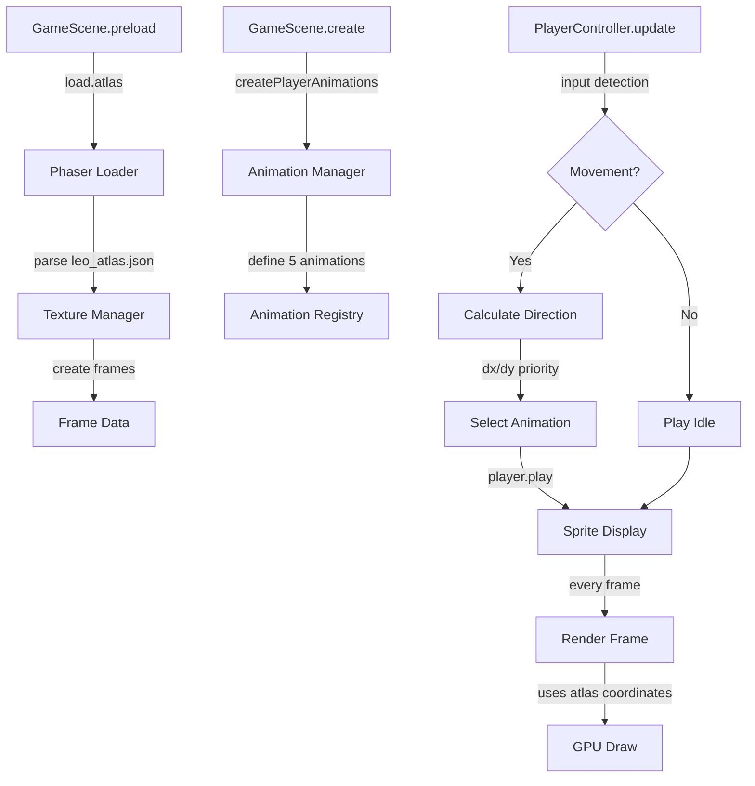

# Atlas e Animações do Personagem Leo

## 📋 Visão Geral

O personagem **Leo** utiliza um sistema de **texture atlas** no formato JSON do Phaser 3, permitindo animações direcionais suaves e organizadas.

---

## 🖼️ Especificações do Spritesheet

### Arquivo: `leo.png`
- **Dimensões totais**: 768 × 64 pixels
- **Layout**: 24 frames em linha horizontal
- **Frame individual**: 32 × 64 pixels
- **Formato**: RGBA8888

### Distribuição de Frames

```
┌─────┬─────┬─────┬─────┬─────┬─────┬─────┬─────┬─────┬─────┬─────┬─────┐
│  0  │  1  │  2  │  3  │  4  │  5  │  6  │  7  │  8  │  9  │ 10  │ 11  │
│ ►01 │ ►02 │ ►03 │ ►04 │ ►05 │ ►06 │ ▲01 │ ▲02 │ ▲03 │ ▲04 │ ▲05 │ ▲06 │
└─────┴─────┴─────┴─────┴─────┴─────┴─────┴─────┴─────┴─────┴─────┴─────┘

┌─────┬─────┬─────┬─────┬─────┬─────┬─────┬─────┬─────┬─────┬─────┬─────┐
│ 12  │ 13  │ 14  │ 15  │ 16  │ 17  │ 18  │ 19  │ 20  │ 21  │ 22  │ 23  │
│ ◄01 │ ◄02 │ ◄03 │ ◄04 │ ◄05 │ ◄06 │ ▼01 │ ▼02 │ ▼03 │ ▼04 │ ▼05 │ ▼06 │
└─────┴─────┴─────┴─────┴─────┴─────┴─────┴─────┴─────┴─────┴─────┴─────┘

Legenda:
► = Andar para Direita (RIGHT)
▲ = Andar para Cima (UP)
◄ = Andar para Esquerda (LEFT)
▼ = Andar para Baixo (DOWN)
```

---

## 📦 Estrutura do Atlas JSON

### Arquivo: `leo_atlas.json`

O atlas segue o formato **Phaser Texture Atlas JSON (Hash)**, contendo:

1. **`frames[]`**: Array com 24 objetos, cada um definindo:
   - `filename`: Nome semântico do frame (ex: `walk_right_01`)
   - `frame`: Coordenadas `{x, y, w, h}` do frame no spritesheet
   - `spriteSourceSize`: Offset do sprite (sem trim = `{0, 0}`)
   - `sourceSize`: Dimensões originais do frame

2. **`meta`**: Metadados do atlas:
   - `image`: Nome do arquivo PNG
   - `size`: Dimensões totais da imagem
   - `format`: Formato de cor (RGBA8888)

### Exemplo de Frame:
```json
{
  "filename": "walk_right_01",
  "frame": { "x": 0, "y": 0, "w": 32, "h": 64 },
  "rotated": false,
  "trimmed": false,
  "spriteSourceSize": { "x": 0, "y": 0, "w": 32, "h": 64 },
  "sourceSize": { "w": 32, "h": 64 }
}
```

---

## 🎬 Animações Implementadas

### 1. **Walk Right** (`walk_right`)
- **Frames**: `walk_right_01` até `walk_right_06` (índices 0-5)
- **Duração**: 6 frames
- **Frame Rate**: 12 fps
- **Loop**: Infinito (`repeat: -1`)

### 2. **Walk Up** (`walk_up`)
- **Frames**: `walk_up_01` até `walk_up_06` (índices 6-11)
- **Duração**: 6 frames
- **Frame Rate**: 12 fps
- **Loop**: Infinito

### 3. **Walk Left** (`walk_left`)
- **Frames**: `walk_left_01` até `walk_left_06` (índices 12-17)
- **Duração**: 6 frames
- **Frame Rate**: 12 fps
- **Loop**: Infinito

### 4. **Walk Down** (`walk_down`)
- **Frames**: `walk_down_01` até `walk_down_06` (índices 18-23)
- **Duração**: 6 frames
- **Frame Rate**: 12 fps
- **Loop**: Infinito

### 5. **Idle** (`idle`)
- **Frame**: `walk_down_01` (frame estático)
- **Frame Rate**: 1 fps
- **Loop**: Sem repetição

---

## 🔧 Implementação Técnica

### 1. Carregamento do Atlas (`loadPlayerAssets.js`)

```javascript
export function loadPlayerAssets(scene) {
  scene.load.atlas(
    'leo',                      // Key da textura
    './src/assets/leo.png',     // Imagem do spritesheet
    './src/assets/leo_atlas.json' // Definições do atlas
  );
}
```

**Diferenças vs Spritesheet Tradicional**:
- ✅ Atlas: Define frames por nome semântico (`walk_right_01`)
- ❌ Spritesheet: Define frames por índice numérico (`0, 1, 2...`)
- ✅ Atlas: Suporta frames de tamanhos diferentes no mesmo arquivo
- ✅ Atlas: Nomes descritivos facilitam manutenção

### 2. Criação de Animações (`playerAnimations.js`)

```javascript
scene.anims.create({
  key: 'walk_right',
  frames: [
    { key: 'leo', frame: 'walk_right_01' },
    { key: 'leo', frame: 'walk_right_02' },
    // ... até walk_right_06
  ],
  frameRate: 12,
  repeat: -1
});
```

**Exportações**:
```javascript
export const ANIM_WALK_RIGHT = 'walk_right';
export const ANIM_WALK_UP = 'walk_up';
export const ANIM_WALK_LEFT = 'walk_left';
export const ANIM_WALK_DOWN = 'walk_down';
export const ANIM_IDLE = 'idle';
```

### 3. Controle de Animações (`PlayerController.js`)

O controlador determina qual animação tocar com base na **direção do movimento**:

```javascript
// Lógica de seleção de animação
if (Math.abs(dx) > Math.abs(dy)) {
  // Movimento horizontal predomina
  animKey = dx > 0 ? ANIM_WALK_RIGHT : ANIM_WALK_LEFT;
} else {
  // Movimento vertical predomina
  animKey = dy > 0 ? ANIM_WALK_DOWN : ANIM_WALK_UP;
}
```

**Prioridade de Direção**:
1. Se `|dx| > |dy|`: usa `walk_right` ou `walk_left`
2. Se `|dy| >= |dx|`: usa `walk_up` ou `walk_down`

**Idle State**:
- Quando não há input, toca a animação `idle`
- Fallback: para no primeiro frame da última direção

---

## 📐 Cálculos de Posição de Frame

Cada frame no atlas é calculado assim:

```javascript
frame_x = frame_index * FRAME_WIDTH
frame_y = 0 (todos na mesma linha)

Exemplo:
- Frame 0 (walk_right_01): x=0, y=0
- Frame 6 (walk_up_01): x=192, y=0
- Frame 12 (walk_left_01): x=384, y=0
- Frame 18 (walk_down_01): x=576, y=0
```

---

## 🎯 Vantagens do Sistema Atual

### ✅ Organização
- Nomes descritivos facilitam debug
- Separação clara entre direções
- Atlas JSON legível e editável

### ✅ Performance
- Phaser carrega atlas uma única vez
- Frames são recortados por coordenadas (sem cópias em memória)
- Animações trocam apenas referências de frame

### ✅ Escalabilidade
- Fácil adicionar novas animações (ataque, pulo, etc.)
- Suporta frames de tamanhos diferentes no futuro
- Atlas pode ser gerado automaticamente por ferramentas (TexturePacker, Shoebox)

### ✅ Manutenibilidade
- Constantes exportadas (`ANIM_WALK_RIGHT`) evitam strings mágicas
- Mudanças no atlas não quebram código (usa nomes, não índices)
- Lógica de animação centralizada em `playerAnimations.js`

---

## 🔄 Fluxo de Renderização



---

## 📊 Tabela de Referência Rápida

| Direção | Animação Key | Frames Usados | Índices | Duração | FPS |
|---------|-------------|---------------|---------|---------|-----|
| Direita | `walk_right` | walk_right_01-06 | 0-5 | 0.5s | 12 |
| Cima | `walk_up` | walk_up_01-06 | 6-11 | 0.5s | 12 |
| Esquerda | `walk_left` | walk_left_01-06 | 12-17 | 0.5s | 12 |
| Baixo | `walk_down` | walk_down_01-06 | 18-23 | 0.5s | 12 |
| Parado | `idle` | walk_down_01 | 18 | - | 1 |

---

## 🛠️ Ferramentas de Debug

### Console Logs Implementados

1. **Load Assets**: `[loadPlayerAssets] Loading leo.png atlas...`
2. **Create Animations**: `[PlayerAnimations] Created "walk_right" animation`
3. **Controller Init**: `[PlayerController] Initialized with player: {...}`

### Verificar Atlas no Browser

```javascript
// No console do DevTools:
console.log(this.textures.get('leo').frames);
console.log(this.anims.get('walk_right'));
```

---

## 📝 Notas de Manutenção

### Adicionar Nova Animação

1. Adicionar frames no `leo_atlas.json`
2. Criar animação em `createPlayerAnimations()`
3. Exportar constante em `playerAnimations.js`
4. Atualizar lógica em `PlayerController.update()`

### Alterar Frame Size

1. Gerar novo `leo_atlas.json` com novas coordenadas
2. Atualizar `FRAME_WIDTH` e `FRAME_HEIGHT` em `loadPlayerAssets.js`
3. Atualizar hitbox em `PlayerFactory.js` se necessário

### Trocar Spritesheet

1. Substituir `leo.png`
2. Regenerar `leo_atlas.json` mantendo mesmos nomes de frame
3. Código continua funcionando (usa nomes, não coordenadas)

---

## 🔗 Arquivos Relacionados

- **Atlas JSON**: `src/assets/leo_atlas.json`
- **Spritesheet**: `src/assets/leo.png`
- **Loader**: `src/player/loadPlayerAssets.js`
- **Animações**: `src/player/playerAnimations.js`
- **Controller**: `src/player/PlayerController.js`
- **Factory**: `src/player/PlayerFactory.js`

---

**Data de Criação**: 2025  
**Versão do Atlas**: 1.0  
**Engine**: Phaser 3.x
