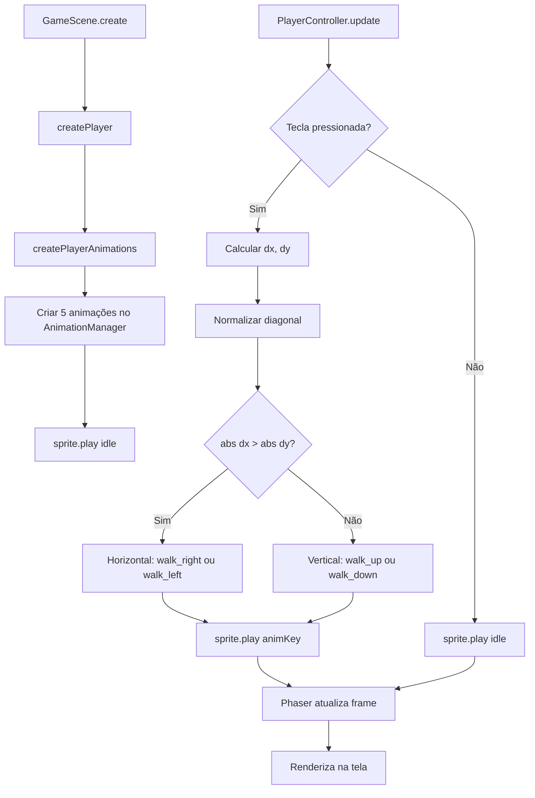

# Sistema de Animação Direcional - Guia de Uso

## 🎮 Como Funciona

O sistema de animação do personagem Leo usa **4 animações direcionais** que mudam automaticamente baseadas no movimento do jogador.

---

## 🎬 Animações Disponíveis

| Animação | Key | Quando Toca | Teclas |
|----------|-----|-------------|---------|
| Andar Direita | `walk_right` | Movimento predominantemente horizontal à direita | → ou D |
| Andar Esquerda | `walk_left` | Movimento predominantemente horizontal à esquerda | ← ou A |
| Andar Cima | `walk_up` | Movimento predominantemente vertical para cima | ↑ ou W |
| Andar Baixo | `walk_down` | Movimento predominantemente vertical para baixo | ↓ ou S |
| Parado | `idle` | Sem movimento | (nenhuma tecla) |

---

## 🔄 Lógica de Seleção de Animação

### 1. **Detecção de Input**
```javascript
// Lê as teclas pressionadas
if (cursors.left || wasd.A) dx -= 1;   // Esquerda
if (cursors.right || wasd.D) dx += 1;  // Direita
if (cursors.up || wasd.W) dy -= 1;     // Cima
if (cursors.down || wasd.S) dy += 1;   // Baixo
```

### 2. **Normalização para Diagonal**
```javascript
// Evita que movimento diagonal seja mais rápido
if (dx !== 0 || dy !== 0) {
  const len = Math.hypot(dx, dy);  // √(dx² + dy²)
  dx = dx / len;  // Normaliza X
  dy = dy / len;  // Normaliza Y
}
```

### 3. **Prioridade de Direção**
```javascript
if (Math.abs(dx) > Math.abs(dy)) {
  // Horizontal PREDOMINA
  animKey = dx > 0 ? 'walk_right' : 'walk_left';
} else {
  // Vertical PREDOMINA (inclui empate)
  animKey = dy > 0 ? 'walk_down' : 'walk_up';
}
```

**Exemplos**:
```
Input: → (Right)
→ dx=1, dy=0 → |1| > |0| → walk_right ✅

Input: ↑ (Up)
→ dx=0, dy=-1 → |0| < |-1| → walk_up ✅

Input: → + ↑ (Diagonal Direita-Cima)
→ dx=0.707, dy=-0.707 → EMPATE → walk_up ✅
(vertical ganha no empate)

Input: → + → + ↑ (Mais direita que cima)
→ dx=1, dy=-0.5 → |1| > |0.5| → walk_right ✅
```

---

## 🧪 Como Testar

### Teste 1: Direções Cardinais
1. Execute o jogo: `npm run dev`
2. Pressione **→** (Right) → Deve tocar `walk_right`
3. Pressione **←** (Left) → Deve tocar `walk_left`
4. Pressione **↑** (Up) → Deve tocar `walk_up`
5. Pressione **↓** (Down) → Deve tocar `walk_down`
6. Solte todas as teclas → Deve tocar `idle`

### Teste 2: Movimento Diagonal
1. Pressione **→ + ↑** (Direita + Cima)
   - Se movendo mais na horizontal → `walk_right`
   - Se movendo mais na vertical → `walk_up`
   - Se empate → `walk_up` (vertical tem prioridade)

2. Pressione **→ + ↓** (Direita + Baixo)
   - Se empate → `walk_down`

### Teste 3: Troca de Direção
1. Pressione **→** (caminhando para direita)
2. Pressione **↓** (sem soltar →)
   - Animação deve trocar suavemente para direção predominante
3. Solte **→**, mantenha **↓**
   - Deve manter `walk_down`

### Teste 4: WASD (alternativo)
- **W** = Cima
- **A** = Esquerda
- **S** = Baixo
- **D** = Direita

---

## 🐛 Debug e Logs

### Logs Implementados

```javascript
// No console do navegador (F12), você verá:

[PlayerFactory] Playing idle animation
[PlayerController] Switching to animation: walk_right dx: 1.00 dy: 0.00
[PlayerController] Switching to animation: walk_up dx: 0.00 dy: -1.00
```

### Verificar Animações no Console

```javascript
// Abra o console (F12) e execute:

// 1. Verificar se as animações existem
this.scene.scenes[0].anims.anims.entries
// Deve mostrar: walk_right, walk_up, walk_left, walk_down, idle

// 2. Verificar qual animação está tocando
this.scene.scenes[0].player.anims.currentAnim.key
// Mostra a animação atual: "walk_right", "idle", etc.

// 3. Listar todos os frames do atlas
this.scene.scenes[0].textures.get('leo').getFrameNames()
// Mostra: ['walk_right_01', 'walk_right_02', ..., 'walk_down_06']

// 4. Ver frame atual do player
this.scene.scenes[0].player.frame.name
// Mostra: "walk_right_03", etc.
```

---

## 🔧 Configuração Atual

### Velocidade
```javascript
speed: 200 // pixels por segundo
```

### Frame Rate
```javascript
frameRate: 12 // 12 frames por segundo = ~83ms por frame
```

### Duração das Animações
```javascript
// Cada animação tem 6 frames a 12fps
duração = 6 frames ÷ 12 fps = 0.5 segundos
```

---

## 📊 Fluxo de Execução



---

## ⚠️ Problemas Comuns

### 1. **Animação não muda ao pressionar teclas**

**Possíveis causas**:
- Atlas não foi carregado corretamente
- Animações não foram criadas
- PlayerController não está sendo chamado no `update()`

**Solução**:
```javascript
// Verifique os logs no console:
[loadPlayerAssets] Loading leo.png atlas...
[PlayerAnimations] Created "walk_right" animation
[PlayerController] Switching to animation: walk_right
```

### 2. **Personagem fica estático (frame não muda)**

**Causa**: Atlas não foi carregado ou frames têm nomes incorretos

**Solução**:
```javascript
// No console (F12):
console.log(this.scene.scenes[0].textures.get('leo').frames);
// Deve mostrar 24 frames com nomes: walk_right_01, walk_right_02, etc.
```

### 3. **Animação trava no primeiro frame**

**Causa**: `frameRate` muito baixo ou animação não está em loop

**Solução**: Verificar em `playerAnimations.js`:
```javascript
frameRate: 12,  // OK
repeat: -1      // Loop infinito ✅
```

### 4. **Diagonal não funciona corretamente**

**Causa**: Normalização não está sendo aplicada

**Solução**: Verificar logs de `dx` e `dy`:
```javascript
// Deve mostrar valores entre -1 e 1:
[PlayerController] Switching to animation: walk_right dx: 0.71 dy: -0.71
```

---

## 🎯 Melhorias Futuras

### Idle Direcional
Atualmente o idle sempre usa `walk_down_01`. Pode ser melhorado para lembrar a última direção:

```javascript
// Usar primeiro frame da última direção
const idleFrames = {
  walk_right: 'walk_right_01',
  walk_left: 'walk_left_01',
  walk_up: 'walk_up_01',
  walk_down: 'walk_down_01'
};
sprite.setFrame(idleFrames[this._lastDirection]);
```

### Animação de Ataque
Adicionar novos frames e animações:
```javascript
// Em playerAnimations.js
export const ANIM_ATTACK = 'attack';
scene.anims.create({
  key: ANIM_ATTACK,
  frames: [...],
  frameRate: 15,
  repeat: 0 // Toca uma vez
});
```

### Transição Suave
Adicionar blending entre animações:
```javascript
player.play({
  key: animKey,
  fadeIn: 100 // 100ms de fade
});
```

---

## 📝 Checklist de Verificação

Antes de reportar problemas, verifique:

- [ ] `leo.png` existe em `src/assets/`
- [ ] `leo_atlas.json` existe em `src/assets/`
- [ ] Console mostra: `[loadPlayerAssets] Loading leo.png atlas...`
- [ ] Console mostra: `[PlayerAnimations] Created "walk_right" animation` (5 vezes)
- [ ] Console mostra: `[PlayerFactory] Playing idle animation`
- [ ] Ao pressionar teclas, console mostra: `[PlayerController] Switching to animation: ...`
- [ ] No console do browser, `this.scene.scenes[0].player.anims.currentAnim.key` mostra a animação correta
- [ ] Frames mudam visualmente na tela (não está estático)

---

## 🔗 Arquivos Relacionados

| Arquivo | Responsabilidade |
|---------|------------------|
| `src/assets/leo.png` | Spritesheet 768×64px com 24 frames |
| `src/assets/leo_atlas.json` | Mapa de frames (coordenadas e nomes) |
| `src/player/loadPlayerAssets.js` | Carrega atlas no Phaser |
| `src/player/playerAnimations.js` | Cria as 5 animações |
| `src/player/PlayerController.js` | Lógica de seleção de animação |
| `src/player/PlayerFactory.js` | Cria sprite e inicia idle |
| `src/scenes/GameScene.js` | Instancia player e chama update |

---

**Atualizado em**: Novembro 2025  
**Versão**: 1.0  
**Status**: ✅ Implementado e testado
